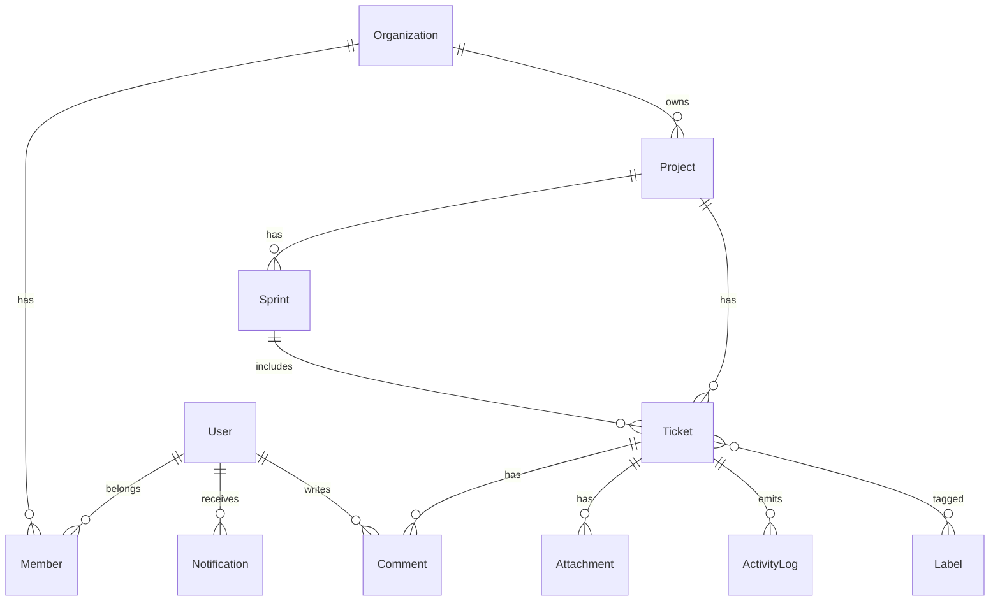

# ER Diagram

```mermaid
erDiagram
  User ||--o{ Member : belongs
  Organization ||--o{ Member : has
  Organization ||--o{ Project : owns
  Project ||--o{ Ticket : has
  Project ||--o{ Sprint : has
  Sprint ||--o{ Ticket : includes
  Ticket ||--o{ Comment : has
  Ticket ||--o{ Attachment : has
  Ticket ||--o{ ActivityLog : emits
  Ticket }o--o{ Label : tagged
  User ||--o{ Comment : writes
  User ||--o{ Notification : receives
```
